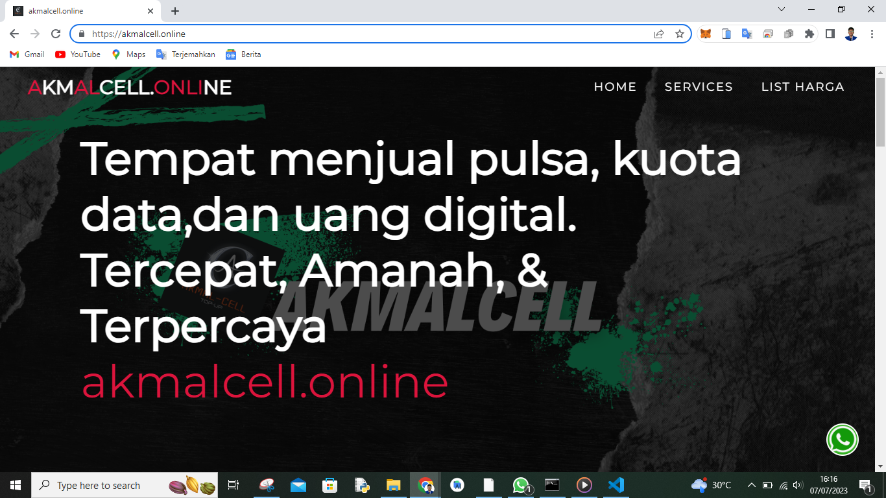
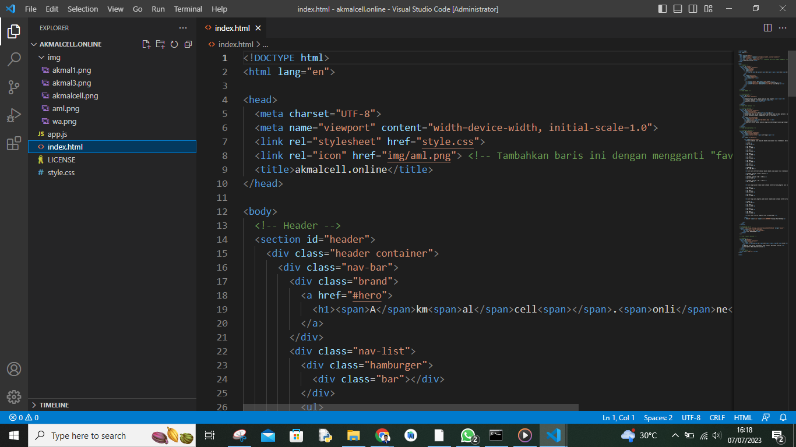

# Pemograman Web2 Pertemuan 16

## Profil
| #               | Biodata                      |
| --------------- | ---------------------------- |
| **Nama**        | M. AKMAL AL ABDILAH          |
| **NIM**         | 312110034                    |
| **Kelas**       | TI.21.A.1                    |
| **Mata Kuliah** | Bisnis Elektronik          |


<p align="center">
 
</p>

<p align="center">
<a href="https://github.com/akmalabdilah"></a>
<p align="center">


<hr>

## Bisnis Elektronik : Promosi

<hr>

 **`Tampilan web`**
 



 Tampilan web


<hr>

Tampilan struktur kode

<hr>



<p>
Kode yang di pakai saya lampirkan di bawah
</p>

```html
<!DOCTYPE html>
<html lang="en">

<head>
  <meta charset="UTF-8">
  <meta name="viewport" content="width=device-width, initial-scale=1.0">
  <link rel="stylesheet" href="style.css">
  <link rel="icon" href="img/aml.png"> <!-- Tambahkan baris ini dengan mengganti "favicon.ico" dengan URL gambar ikon -->
  <title>akmalcell.online</title>
</head>

<body>
  <!-- Header -->
  <section id="header">
    <div class="header container">
      <div class="nav-bar">
        <div class="brand">
          <a href="#hero">
            <h1><span>A</span>km<span>al</span>cell<span></span>.<span>onli</span>ne</h1>
          </a>
        </div>
        <div class="nav-list">
          <div class="hamburger">
            <div class="bar"></div>
          </div>
          <ul>
            <li><a href="#hero" data-after="Home">Home</a></li>
            <li><a href="#services" data-after="Service">Services</a></li>
            <li><a href="#projects" data-after="List Harga">List Harga</a></li>
          </ul>
        </div>
      </div>
    </div>
  </section>
  <!-- End Header -->


  <!-- Hero Section  -->
  <section id="hero">
    <div class="hero container">
      <div>
        <h1>Tempat menjual pulsa, kuota data,dan uang digital.<span></span></h1>
        <h1>Tercepat, Amanah, & Terpercaya<span></span></h1>
        <h1>akmalcell.online<span></span></h1>
      </div>
    </div>
  </section>
  <!-- End Hero Section  -->

  <!-- Service Section -->
  <section id="services">
    <div class="services container">
      <div class="service-top">
        <h1 class="section-title">Serv<span>i</span>ces</h1>
        <p>Menyediakan Jasa Top Up diamon, pulsa dan kuota data ke semua operator, uang digital, dan token listrik. Dengan harga terjangkau!</p>
        <p>Metode pembayaran dapat menggunakan DANA via WhatsApp.</p>
      </div>
      <div class="service-bottom">
        <div class="service-item">
          <div class="icon"></div>
          <h2>akmalcell.online</h2>
          <p>akmalcell.online adalah website yang didirikan dengan tujuan agar mempermudah pembeli dalam mencari kebutuhan internet, uang digital (diamond game), dan token listrik.</p>
        </div>
      </div>
    </div>
  </section>
  <!-- End Service Section -->

  <!-- Projects Section -->
  <section id="projects">
    <div class="projects container">
      <div class="projects-header">
        <h1 class="section-title"><span>List Harga</span></h1>
      </div>
      <div class="all-projects">
        
          <div class="project-info">
            <h2>Pulsa indosat list harga di bawah jika oprator lain (telkomsel, dan xl) chat via WhatsApp.</h2>

            <p>5.000</p>
            <p>Rp. 8.000</p>

            <p>10.000</p>
            <p>Rp. 13.000</p>

            <p>15.000</p>
            <p>Rp. 18.000</p>

            <p>20.000</p>
            <p>Rp. 23.000</p>

            <p>25.000</p>
            <p>Rp. 28.000</p>

            <p>30.000</p>
            <p>Rp. 33.000</p>

            <p>50.000</p>
            <p>Rp. 53.000</p>

            <p>100.000</p>
            <p>Rp. 103.000</p>

            <h2>list kuota Internet indosat ada di bawah jika oprator lain (telkomsel, dan xl) chat via WhatsApp.</h2>
            
            <p>Freedom internet 2,5 GB / 5 Hari</p>
            <p>Rp. 13.000</p>

            <p>Freedom internet 5 GB / 5 Hari</p>
            <p>Rp. 17.000</p>

            <p>Freedom internet 7 GB / 7 Hari</p>
            <p>Rp. 22.000</p>


            <h2>lits uang digital (Dana) ada di bawah untuk list uang digital lain (shopee, gojek, dan ovo.) bisa chat via WhatsApp.</h2>
            
            <p>10.000</p>
            <p>Rp. 13.000</p>

            <p>20.000</p>
            <p>Rp. 23.000</p>

            <p>30.000</p>
            <p>Rp. 33.000</p>


            <h2>List harga uang digital game mobile legends ada di bawah untuk list uang digital game lain (free fire, google play, dan pubg) bisa chat via WhatsApp.</h2>
            
            <p>5.000</p>
            <p>Rp. 8.000</p>

            <p>10.000</p>
            <p>Rp. 13.000</p>

            <p>20.000</p>
            <p>Rp. 23.000</p>

            <p>50.000</p>
            <p>Rp. 55.000</p>

            <h2>List token listrik langsung chat via whatsApp.</h2>
            
          </div>
          <a href="#" class="cta" style="color:#000000">Hubungi Via WhatsApp</a>          
        
        
      </div>
    </div>
  </section>

  <!-- Floating wa -->
  <a href="https://api.whatsapp.com/send/?phone=6285693550108" target="_blank">
    <button class="btn-floating whatsapp">
        
        <span>(+62) 85693550108</span>
    </button>
  </a>

  <!-- End Projects Section -->

  <!-- Footer -->
  <section id="footer">
    <div class="footer container">
      <div class="brand">
        <h1><span>A</span>km<span>al</span>cell<span></span>.<span>O</span>nline</h1>
      </div>
      <h2>Website jual pulsa, kuota data, uang digital, dan token listrik.</h2>
      <p>Copyright © 2023 akmalcell.online</p>
    </div>
  </section>
  <!-- End Footer -->
  <script src="./app.js"></script>
</body>

</html>
```


```js
const hamburger = document.querySelector('.header .nav-bar .nav-list .hamburger');
const mobile_menu = document.querySelector('.header .nav-bar .nav-list ul');
const menu_item = document.querySelectorAll('.header .nav-bar .nav-list ul li a');
const header = document.querySelector('.header.container');

hamburger.addEventListener('click', () => {
	hamburger.classList.toggle('active');
	mobile_menu.classList.toggle('active');
});

document.addEventListener('scroll', () => {
	var scroll_position = window.scrollY;
	if (scroll_position > 250) {
		header.style.backgroundColor = '#29323c';
	} else {
		header.style.backgroundColor = 'transparent';
	}
});

menu_item.forEach((item) => {
	item.addEventListener('click', () => {
		hamburger.classList.toggle('active');
		mobile_menu.classList.toggle('active');
	});
});

```

```LICENCES
MIT License

Copyright (c) 2020 Web Cifar

Permission is hereby granted, free of charge, to any person obtaining a copy
of this software and associated documentation files (the "Software"), to deal
in the Software without restriction, including without limitation the rights
to use, copy, modify, merge, publish, distribute, sublicense, and/or sell
copies of the Software, and to permit persons to whom the Software is
furnished to do so, subject to the following conditions:

The above copyright notice and this permission notice shall be included in all
copies or substantial portions of the Software.

THE SOFTWARE IS PROVIDED "AS IS", WITHOUT WARRANTY OF ANY KIND, EXPRESS OR
IMPLIED, INCLUDING BUT NOT LIMITED TO THE WARRANTIES OF MERCHANTABILITY,
FITNESS FOR A PARTICULAR PURPOSE AND NONINFRINGEMENT. IN NO EVENT SHALL THE
AUTHORS OR COPYRIGHT HOLDERS BE LIABLE FOR ANY CLAIM, DAMAGES OR OTHER
LIABILITY, WHETHER IN AN ACTION OF CONTRACT, TORT OR OTHERWISE, ARISING FROM,
OUT OF OR IN CONNECTION WITH THE SOFTWARE OR THE USE OR OTHER DEALINGS IN THE
SOFTWARE.

```

```css
@import 'https://fonts.googleapis.com/css?family=Montserrat:300, 400, 700&display=swap';
* {
	padding: 0;
	margin: 0;
	box-sizing: border-box;
}
html {
	font-size: 10px;
	font-family: 'Montserrat', sans-serif;
	scroll-behavior: smooth;
}
a {
	text-decoration: none;
}
.container {
	min-height: 100vh;
	width: 100%;
	display: flex;
	align-items: center;
	justify-content: center;
}
img {
	height: 100%;
	width: 100%;
	object-fit: cover;
}
p {
	color: black;
	font-size: 1.4rem;
	margin-top: 5px;
	line-height: 2.5rem;
	font-weight: 300;
	letter-spacing: 0.05rem;
}
.section-title {
	font-size: 4rem;
	font-weight: 300;
	color: black;
	margin-bottom: 10px;
	text-transform: uppercase;
	letter-spacing: 0.2rem;
	text-align: center;
}
.section-title span {
	color: crimson;
}

.cta {
	display: inline-block;
	padding: 10px 30px;
	color: white;
	background-color: transparent;
	border: 2px solid crimson;
	font-size: 2rem;
	text-transform: uppercase;
	letter-spacing: 0.1rem;
	margin-top: 30px;
	transition: 0.3s ease;
	transition-property: background-color, color;
}
.cta:hover {
	color: white;
	background-color: crimson;
}
.brand h1 {
	font-size: 3rem;
	text-transform: uppercase;
	color: white;
}
.brand h1 span {
	color: crimson;
}

/* Header section */
#header {
	position: fixed;
	z-index: 1000;
	left: 0;
	top: 0;
	width: 100vw;
	height: auto;
}
#header .header {
	min-height: 8vh;
	background-color: rgba(31, 30, 30, 0.24);
	transition: 0.3s ease background-color;
}
#header .nav-bar {
	display: flex;
	align-items: center;
	justify-content: space-between;
	width: 100%;
	height: 100%;
	max-width: 1300px;
	padding: 0 10px;
}
#header .nav-list ul {
	list-style: none;
	position: absolute;
	background-color: rgb(31, 30, 30);
	width: 100vw;
	height: 100vh;
	left: 100%;
	top: 0;
	display: flex;
	flex-direction: column;
	justify-content: center;
	align-items: center;
	z-index: 1;
	overflow-x: hidden;
	transition: 0.5s ease left;
}
#header .nav-list ul.active {
	left: 0%;
}
#header .nav-list ul a {
	font-size: 2.5rem;
	font-weight: 500;
	letter-spacing: 0.2rem;
	text-decoration: none;
	color: white;
	text-transform: uppercase;
	padding: 20px;
	display: block;
}
#header .nav-list ul a::after {
	content: attr(data-after);
	position: absolute;
	top: 50%;
	left: 50%;
	transform: translate(-50%, -50%) scale(0);
	color: rgba(240, 248, 255, 0.021);
	font-size: 13rem;
	letter-spacing: 50px;
	z-index: -1;
	transition: 0.3s ease letter-spacing;
}
#header .nav-list ul li:hover a::after {
	transform: translate(-50%, -50%) scale(1);
	letter-spacing: initial;
}
#header .nav-list ul li:hover a {
	color: crimson;
}
#header .hamburger {
	height: 60px;
	width: 60px;
	display: inline-block;
	border: 3px solid white;
	border-radius: 50%;
	position: relative;
	display: flex;
	align-items: center;
	justify-content: center;
	z-index: 100;
	cursor: pointer;
	transform: scale(0.8);
	margin-right: 20px;
}
#header .hamburger:after {
	position: absolute;
	content: '';
	height: 100%;
	width: 100%;
	border-radius: 50%;
	border: 3px solid white;
	animation: hamburger_puls 1s ease infinite;
}
#header .hamburger .bar {
	height: 2px;
	width: 30px;
	position: relative;
	background-color: white;
	z-index: -1;
}
#header .hamburger .bar::after,
#header .hamburger .bar::before {
	content: '';
	position: absolute;
	height: 100%;
	width: 100%;
	left: 0;
	background-color: white;
	transition: 0.3s ease;
	transition-property: top, bottom;
}
#header .hamburger .bar::after {
	top: 8px;
}
#header .hamburger .bar::before {
	bottom: 8px;
}
#header .hamburger.active .bar::before {
	bottom: 0;
}
#header .hamburger.active .bar::after {
	top: 0;
}
/* End Header section */

/* Hero Section */
#hero {
	background-image: url(./img/akmalcell.png);
	background-size: cover;
	background-position: top center;
	position: relative;
	z-index: 1;
}
#hero::after {
	content: '';
	position: absolute;
	left: 0;
	top: 0;
	height: 100%;
	width: 100%;
	background-color: black;
	opacity: 0.7;
	z-index: -1;
}
#hero .hero {
	max-width: 1200px;
	margin: 0 auto;
	padding: 0 50px;
	justify-content: flex-start;
}
#hero h1 {
	display: block;
	width: fit-content;
	font-size: 4rem;
	position: relative;
	color: transparent;
	animation: text_reveal 0.5s ease forwards;
	animation-delay: 1s;
}
#hero h1:nth-child(1) {
	animation-delay: 1s;
}
#hero h1:nth-child(2) {
	animation-delay: 2s;
}
#hero h1:nth-child(3) {
	animation: text_reveal_name 0.5s ease forwards;
	animation-delay: 3s;
}
#hero h1 span {
	position: absolute;
	top: 0;
	left: 0;
	height: 100%;
	width: 0;
	background-color: crimson;
	animation: text_reveal_box 1s ease;
	animation-delay: 0.5s;
}
#hero h1:nth-child(1) span {
	animation-delay: 0.5s;
}
#hero h1:nth-child(2) span {
	animation-delay: 1.5s;
}
#hero h1:nth-child(3) span {
	animation-delay: 2.5s;
}

/* End Hero Section */

/* Services Section */
#services .services {
	flex-direction: column;
	text-align: center;
	max-width: 1500px;
	margin: 0 auto;
	padding: 100px 0;
}
#services .service-top {
	max-width: 500px;
	margin: 0 auto;
}
#services .service-bottom {
	display: flex;
	align-items: center;
	justify-content: center;
	flex-wrap: wrap;
	margin-top: 50px;
}
#services .service-item {
	flex-basis: 80%;
	display: flex;
	align-items: flex-start;
	justify-content: center;
	flex-direction: column;
	padding: 30px;
	border-radius: 10px;
	background-image: url(./img/akmal3.png);
	background-size: cover;
	margin: 10px 5%;
	position: relative;
	z-index: 1;
	overflow: hidden;
}
#services .service-item::after {
	content: '';
	position: absolute;
	left: 0;
	top: 0;
	height: 100%;
	width: 100%;
	background-image: linear-gradient(60deg, 29323c 0%, #485563 100%);
	opacity: 0.9;
	z-index: -1;
}
#services .service-bottom .icon {
	height: 80px;
	width: 80px;
	margin-bottom: 20px;
}
#services .service-item h2 {
	font-size: 2rem;
	color: white;
	margin-bottom: 10px;
	text-transform: uppercase;
}
#services .service-item p {
	color: white;
	text-align: left;
}
/* End Services Section */

/* Projects section */
#projects .projects {
	flex-direction: column;
	max-width: 1200px;
	margin: 0 auto;
	padding: 100px 0;
}
#projects .projects-header h1 {
	margin-bottom: 50px;
}
#projects .all-projects {
	display: flex;
	align-items: center;
	justify-content: center;
	flex-direction: column;
}
#projects .project-item {
	display: flex;
	align-items: center;
	justify-content: center;
	flex-direction: column;
	width: 80%;
	margin: 20px auto;
	overflow: hidden;
	border-radius: 10px;
}
#projects .project-info {
	padding: 80px;
	flex-basis: 70%;
	height: 100%;
	display: flex;
	align-items: flex-start;
	justify-content: center;
	flex-direction: column;
	background-image: linear-gradient(60deg, #29323c 0%, #0d0d0e 100%);
	color: white;
}
#projects .project-info h1 {
	font-size: 4rem;
	font-weight: 500;
}
#projects .project-info h2 {
	font-size: 1.8rem;
	font-weight: 500;
	margin-top: 10px;
}
#projects .project-info p {
	color: white;
}
#projects .project-img {
	flex-basis: 50%;
	height: 300px;
	overflow: hidden;
	position: relative;
}
#projects .project-img:after {
	content: '';
	position: absolute;
	left: 0;
	top: 0;
	height: 100%;
	width: 100%;
	background-image: linear-gradient(60deg, #29323c 0%, #0d78eb 100%);
	opacity: 0.7;
}
#projects .project-img img {
	transition: 0.3s ease transform;
}
#projects .project-item:hover .project-img img {
	transform: scale(1.1);
}
/* End Projects section */

/* About Section */
#about .about {
	flex-direction: column-reverse;
	text-align: center;
	max-width: 1200px;
	margin: 0 auto;
	padding: 100px 20px;
}
#about .col-left {
	width: 250px;
	height: 360px;
}
#about .col-right {
	width: 100%;
}
#about .col-right h2 {
	font-size: 1.8rem;
	font-weight: 500;
	letter-spacing: 0.2rem;
	margin-bottom: 10px;
}
#about .col-right p {
	margin-bottom: 20px;
}
#about .col-right .cta {
	color: black;
	margin-bottom: 50px;
	padding: 10px 20px;
	font-size: 2rem;
}
#about .col-left .about-img {
	height: 100%;
	width: 100%;
	position: relative;
	border: 10px solid white;
}
#about .col-left .about-img::after {
	content: '';
	position: absolute;
	left: -33px;
	top: 19px;
	height: 98%;
	width: 98%;
	border: 7px solid crimson;
	z-index: -1;
}
/* End About Section */

/* contact Section */
#contact .contact {
	flex-direction: column;
	max-width: 1200px;
	margin: 0 auto;
	width: 90%;
}
#contact .contact-items {
	/* max-width: 400px; */
	width: 100%;
}
#contact .contact-item {
	width: 80%;
	padding: 20px;
	text-align: center;
	border-radius: 10px;
	padding: 30px;
	margin: 30px;
	display: flex;
	justify-content: center;
	align-items: center;
	flex-direction: column;
	box-shadow: 0px 0px 18px 0 #0000002c;
	transition: 0.3s ease box-shadow;
}
#contact .contact-item:hover {
	box-shadow: 0px 0px 5px 0 #0000002c;
}
#contact .icon {
	width: 70px;
	margin: 0 auto;
	margin-bottom: 10px;
}
#contact .contact-info h1 {
	font-size: 2.5rem;
	font-weight: 500;
	margin-bottom: 5px;
}
#contact .contact-info h2 {
	font-size: 1.3rem;
	line-height: 2rem;
	font-weight: 500;
}
/*End contact Section */

/* Footer */
#footer {
	background-image: linear-gradient(60deg, #0a0a0a 0%, #0e4061 100%);
}
#footer .footer {
	min-height: 200px;
	flex-direction: column;
	padding-top: 50px;
	padding-bottom: 10px;
}
#footer h2 {
	color: white;
	font-weight: 500;
	font-size: 1.8rem;
	letter-spacing: 0.1rem;
	margin-top: 10px;
	margin-bottom: 10px;
}
#footer .social-icon {
	display: flex;
	margin-bottom: 30px;
}
#footer .social-item {
	height: 50px;
	width: 50px;
	margin: 0 5px;
}
#footer .social-item img {
	filter: grayscale(1);
	transition: 0.3s ease filter;
}
#footer .social-item:hover img {
	filter: grayscale(0);
}
#footer p {
	color: white;
	font-size: 1.3rem;
}
/* End Footer */

/* Keyframes */
@keyframes hamburger_puls {
	0% {
		opacity: 1;
		transform: scale(1);
	}
	100% {
		opacity: 0;
		transform: scale(1.4);
	}
}
@keyframes text_reveal_box {
	50% {
		width: 100%;
		left: 0;
	}
	100% {
		width: 0;
		left: 100%;
	}
}
@keyframes text_reveal {
	100% {
		color: white;
	}
}
@keyframes text_reveal_name {
	100% {
		color: crimson;
		font-weight: 500;
	}
}
/* End Keyframes */

/* Media Query For Tablet */
@media only screen and (min-width: 768px) {
	.cta {
		font-size: 2.5rem;
		padding: 20px 60px;
	}
	h1.section-title {
		font-size: 6rem;
	}

	/* Hero */
	#hero h1 {
		font-size: 7rem;
	}
	/* End Hero */

	/* Services Section */
	#services .service-bottom .service-item {
		flex-basis: 45%;
		margin: 2.5%;
	}
	/* End Services Section */

	/* Project */
	#projects .project-item {
		flex-direction: row;
	}
	#projects .project-item:nth-child(even) {
		flex-direction: row-reverse;
	}
	#projects .project-item {
		height: 400px;
		margin: 0;
		width: 100%;
		border-radius: 0;
	}
	#projects .all-projects .project-info {
		height: 100%;
	}
	#projects .all-projects .project-img {
		height: 100%;
	}
	/* End Project */

	/* About */
	#about .about {
		flex-direction: row;
	}
	#about .col-left {
		width: 600px;
		height: 400px;
		padding-left: 60px;
	}
	#about .about .col-left .about-img::after {
		left: -45px;
		top: 34px;
		height: 98%;
		width: 98%;
		border: 10px solid crimson;
	}
	#about .col-right {
		text-align: left;
		padding: 30px;
	}
	#about .col-right h1 {
		text-align: left;
	}
	/* End About */

	/* contact  */
	#contact .contact {
		flex-direction: column;
		padding: 100px 0;
		align-items: center;
		justify-content: center;
		min-width: 20vh;
	}
	#contact .contact-items {
		width: 100%;
		display: flex;
		flex-direction: row;
		justify-content: space-evenly;
		margin: 0;
	}
	#contact .contact-item {
		width: 30%;
		margin: 0;
		flex-direction: row;
	}
	#contact .contact-item .icon {
		height: 100px;
		width: 100px;
	}
	#contact .contact-item .icon img {
		object-fit: contain;
	}
	#contact .contact-item .contact-info {
		width: 100%;
		text-align: left;
		padding-left: 20px;
	}
	/* End contact  */
}
/* End Media Query For Tablet */

/* Media Query For Desktop */
@media only screen and (min-width: 1200px) {
	/* header */
	#header .hamburger {
		display: none;
	}
	#header .nav-list ul {
		position: initial;
		display: block;
		height: auto;
		width: fit-content;
		background-color: transparent;
	}
	#header .nav-list ul li {
		display: inline-block;
	}
	#header .nav-list ul li a {
		font-size: 1.8rem;
	}
	#header .nav-list ul a:after {
		display: none;
	}
	/* End header */

	#services .service-bottom .service-item {
		flex-basis: 22%;
		margin: 1.5%;
	}
}

.list-group {
    display: -webkit-box;
    display: -ms-flexbox;
    display: flex;
    -webkit-box-orient: vertical;
    -webkit-box-direction: normal;
    -ms-flex-direction: column;
    flex-direction: column;
    padding-left: 0;
    margin-bottom: 0;
    border-radius: 0.25rem;
    border-top-left-radius: 0.25rem;
    border-top-right-radius: 0.25rem;
    border-bottom-right-radius: 0.25rem;
    border-bottom-left-radius: 0.25rem;
}

/* Floating chat */
body {
    background: linear-gradient(90deg, #f1f1f7 0%, #636061 100%);
}

.btn-floating {
    position: fixed;
    right: 25px;
    overflow: hidden;
    width: 50px;
    height: 50px;
    border-radius: 100px;
    border: 0;
    z-index: 9999;
    color: white;
    transition: .2s;
}

.btn-floating:hover {
    width: auto;
    padding: 0 20px;
    cursor: pointer;
}

.btn-floating span {
    font-size: 16px;
    margin-left: 5px;
    transition: .2s;
    line-height: 0px;
    display: none;
}

.btn-floating:hover span {
    display: inline-block;
}

.btn-floating:hover img {
    margin-bottom: -3px;
}

.btn-floating.whatsapp {
    bottom: 25px;
    background-color: #34af23;
    border: 2px solid #fff;
}

.btn-floating.whatsapp:hover {
    background-color: #1f7a12;
}

.btn-floating.facebook {
    bottom: 85px;
    background-color: #1876f3;
    border: 2px solid #fff;
}

.btn-floating.facebook:hover {
    background-color: #1876f3;
}


/* End  Media Query For Desktop */

```


<p>
Lebih lengkap kalian bisa lihat web resminya langsung link : https://akmalcell.online/
</p>


  <hr>
  
  Cukup Sekian Penjelasan web promosi ini 

  
  **SELESAI**
  <hr>


<div>
<h2 align="center">Thanks For Reading!!!</h2>
<div align="center">


